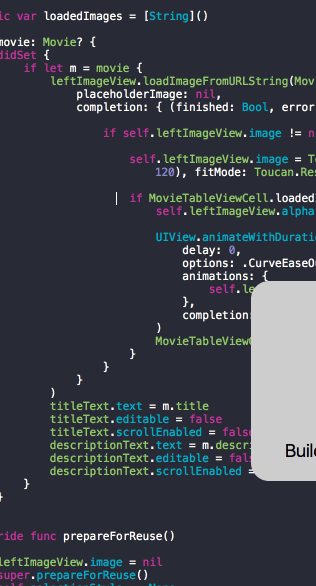

# Assignment 1
Tip
==================

Movies app
Time spent: 48 hours

Completed user stories:

* [x] Required: User can view a list of movies currently playing in theaters from The Movie Database. Poster images must be loaded asynchronously.
* [x] Required: User can view movie details by tapping on a cell.
* [x] Required: User sees loading state while waiting for movies API.
* [x] Required: User sees an error message when there's a networking error.
* [x] Required: User can pull to refresh the movie list.
* [x] Optional: Add a tab bar for Now Playing or Top Rated movies. (high)
* [x] Optional: Add a search bar. (med)
* [x] Optional: All images fade in as they are loading. (low)

**Walkthrough of required and optional user stories:**

